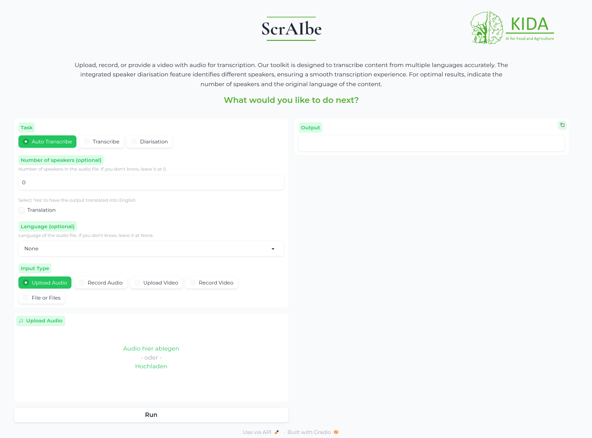

# ScrAIbe-WebUI

Welcome to ScrAIbe-WebUI, a user-friendly web service for automated transcriptions, built on top of our innovative backend framework,  [ScrAIbe](https://github.com/JSchmie/ScrAIbe). ScrAIbe-WebUI provides a no-code solution that allows users to deploy the service locally with ease using Docker.

## Features 🌟

### Gradio-Based Interface
- **User-Friendly Interface**: Leveraging Gradio, ScrAIbe-WebUI provides an intuitive web interface that makes it easy for users to interact with the transcription services without any coding requirement.

### Real-Time and Asynchronous Transcription Modes
- **Synchronous Transcription** 🕒: Perfect for live applications, this mode allows users to perform real-time transcriptions, enabling instant text output as audio is being spoken.
- **Asynchronous Transcription** 📨: Designed for batch processing, users can connect ScrAIbe-WebUI to a mail client, allowing them to send emails with attachments (audio or video files) that are transcribed automatically, with results sent back via email.

### Comprehensive Media Support
- **Broad File Format Compatibility** 🎥🎙: Supports a wide range of audio and video file types, ensuring flexibility in handling media from various sources.
- **Direct Input Options** 📹: Users can directly utilize their webcam or microphone to record audio or video for transcription.

### Advanced Model Integration
- **Multiple Transcription Models** 🌍: Users can select from all available Whisper models, accommodating multiple languages to suit global needs.
- **Speaker Diarization** 🗣: Integrates with Pyannote, an advanced tool for speaker diarization, which identifies and separates different speakers in the transcription process.

### Configurable and Extensible
- **Custom Configuration** ⚙️: Users can fine-tune settings and preferences via a `config.yaml` file.
- **CLI Support** 🖥: For advanced users, ScrAIbe-WebUI includes a command line interface.

### Deployment Options
- **Docker Compatibility** 🐳: Easy deployment using Docker.
- **Docker Compose Support** 📦: Manage multi-container Docker applications with ease.

### Open Source and Community-Driven
- **GPL-2.0 License** 📜: Promoting collaboration and development.

## Getting Started 🚀

ScrAIbe-WebUI offers multiple installation methods, including Docker, pip, and building from scratch. To choose the method that best suits your needs and to get detailed step-by-step instructions, please refer to our [Getting Started Guide](./docs/GETTING_STARTED.md).

## Advanced Setup 🛠

For advanced configuration and usage, please refer to our Advanced Setup Tutorial.
Contributing

## Contributions
We welcome contributions! Please see our Contributing Guidelines for more information.

## License

ScrAIbe-WebUI is open source and available under the GPL-2.0 license. For more information, see the [LICENSE](./LICENSE) file in this repository.
