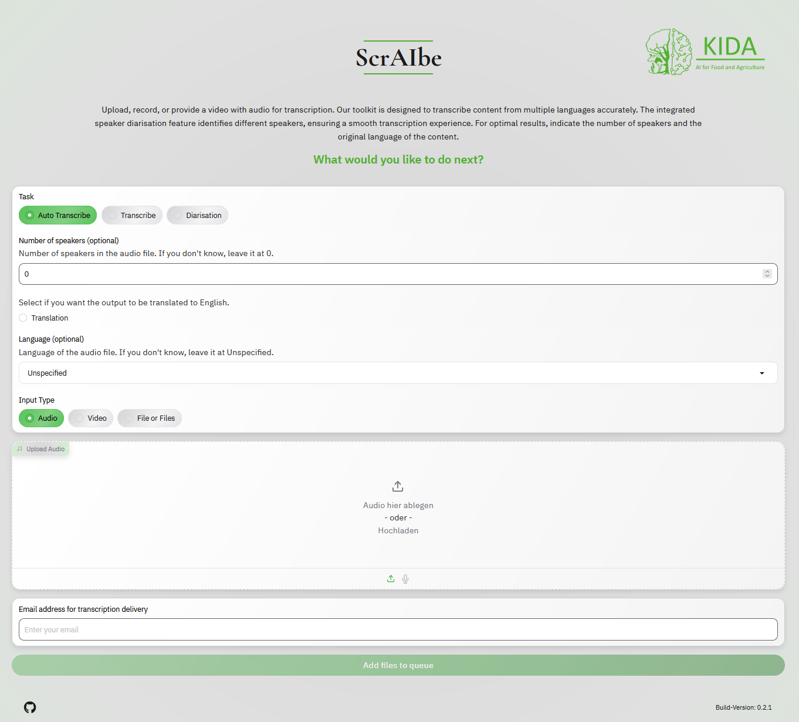

# ScrAIbe-WebUI

Welcome to ScrAIbe-WebUI, a user-friendly web service for automated transcriptions, built on top of our innovative backend framework,  [ScrAIbe](https://github.com/JSchmie/ScrAIbe). ScrAIbe-WebUI provides a no-code solution that allows users to deploy the service locally with ease using Docker.

  
  

## Features 🌟

### Gradio-Based Interface

- **User-Friendly Interface**: Leveraging Gradio, ScrAIbe-WebUI provides an intuitive web interface that makes it easy for users to interact with the transcription services without any coding requirement.

### Real-Time and Asynchronous Transcription Modes

- **Synchronous Transcription** 🕒: Perfect for live applications, this mode allows users to perform real-time transcriptions, enabling instant text output as audio is being spoken.
- **Asynchronous Transcription** 📨: ScrAIbe-WebUI is designed for asynchronous processing, allowing users to connect ScrAIbe-WebUI to a mail client, allowing them to upload their audio or video files using the WebUI, that are automatically transcribed, with results sent back via email including file attachment.

### Comprehensive Media Support

- **Broad File Format Compatibility** 🎥🎙: Supports a wide range of audio and video file types compatible with [FFmpeg](https://ffmpeg.org/), ensuring flexibility in handling media from various sources. This means you can use almost any media file format, including MP3, WAV, MP4, AVI, MKV, and many more.
- **Direct Input Options** 📹: Users can directly utilize their webcam or microphone to record audio or video for transcription.

### Advanced Model Integration

- **Multiple Transcription Models** 🌍: Users can select from all available [Whisper](https://github.com/openai/whisper) models, accommodating multiple languages to suit global needs. Additionally, [faster-whisper](https://github.com/SYSTRAN/faster-whisper) is included, providing quantized models that deliver much faster performance on CPU, making transcription more efficient and accessible.
- **Speaker Diarization** 🗣: Integrates with [Pyannote](https://github.com/pyannote/pyannote-audio), an advanced tool for speaker diarization. This feature identifies and separates different speakers in the transcription process, ensuring accurate and clear attribution of speech to individual speakers.

### Configurable and Extensible

- **Custom Configuration** ⚙️: Users can fine-tune settings and preferences via a `config.yaml` file. This file allows for detailed customization of the application's behavior, including specifying custom headers, footers, and other UI elements, as well as configuring transcription models and service parameters.
- **CLI Support** 🖥: For advanced users, ScrAIbe-WebUI includes a powerful command line interface, enabling scripting and automation of transcription tasks. This makes it ideal for integrating with other tools and workflows in a seamless and efficient manner.

### Deployment Options

- **Docker Compatibility** 🐳: Enjoy easy and consistent deployment using Docker. With Docker, you can run ScrAIbe-WebUI in a containerized environment, ensuring that it runs smoothly across different systems and configurations.
- **Docker Compose Support** 📦: Manage multi-container Docker applications with ease using Docker Compose. This feature simplifies the process of setting up and managing complex applications by allowing you to define and run multi-container Docker applications in a single file.

### Open Source and Community-Driven

- **GPL-3.0 License** 📜: ScrAIbe-WebUI is open source and licensed under the GPL-3.0 license, promoting collaboration and development within the community. We encourage contributions from developers and users to help improve and expand the capabilities of the application.

## Getting Started 🚀

ScrAIbe-WebUI makes it easy to start transcribing with multiple installation methods tailored to suit your needs. Whether you’re a beginner or an advanced user, we have you covered!

### Installation Methods

- **Docker** 🐳: The simplest and most efficient way to deploy ScrAIbe-WebUI. Containerize the application to ensure a consistent environment across different systems. [Get Started with Docker](./docs/GETTING_STARTED_DOCKER.md)
- **PyPI Package** 📦: Install ScrAIbe-WebUI via pip for seamless integration with your Python environment. [Learn How to Install via PyPI](./docs/GETTING_STARTED.md#pypi-package)
- **Build from Scratch** 🔧: For those who like to get their hands dirty, build ScrAIbe-WebUI from the ground up. [See the Step-by-Step Guide](./docs/GETTING_STARTED.md#build-from-scratch)

### Detailed Guides

For detailed step-by-step instructions on each installation method, please refer to our comprehensive [Getting Started Guide](./docs/GETTING_STARTED.md). This guide will walk you through everything you need to know to set up and configure ScrAIbe-WebUI.

### Recommended Method

If you prefer the easiest and quickest setup, we highly recommend using Docker. This method allows you to containerize ScrAIbe-WebUI, ensuring a consistent and hassle-free deployment across various environments.

Ready to dive in? [Check out our Docker Guide](./docs/GETTING_STARTED_DOCKER.md) and get started in no time!

---

Happy transcribing! 🎉

## Advanced Setup 🛠

For those looking to customize and extend the functionality of ScrAIbe-WebUI, our [Advanced Setup Tutorial](./docs/Customize.md) provides all the details you need. From fine-tuning configurations to integrating additional features, this guide will help you make the most of ScrAIbe-WebUI's powerful capabilities.

### Contributions 🤝

We warmly welcome contributions from the community! Whether you’re fixing bugs, adding new features, or improving documentation, your help is invaluable. Please see our [Contributing Guidelines](./CONTRIBUTING.md) for more information on how to get involved and make your mark on ScrAIbe-WebUI.

### License 📜

ScrAIbe-WebUI is proudly open source and licensed under the GPL-3.0 license. This promotes a collaborative and transparent development process. For more details, see the [LICENSE](./LICENSE) file in this repository.

---

Join us in making ScrAIbe-WebUI even better! 🚀
